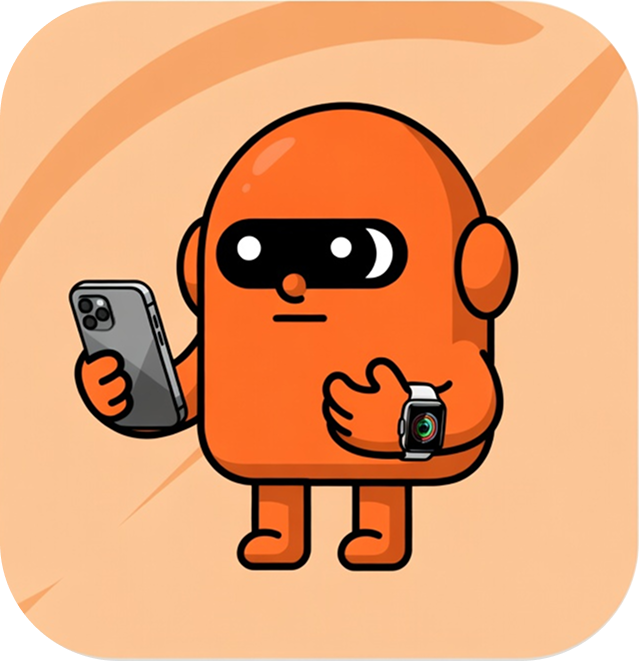

<p align="center">
  
</p>

<h1 align="center">Claude Watch — 모바일 모니터 (아이폰 · 안드로이드)</h1>

<p align="center">
  PC에서 돌아가는 <strong>Claude Code를 스마트폰에서 지켜보고</strong>,<br/>
  <strong>알림 받고</strong>, <strong>권한을 승인</strong>하는 도구. <br/>
  <b>Mac · Xcode · 앱스토어 없이</b> 폰 브라우저(웹앱)만으로. 연결은 무료 <a href="https://tailscale.com">Tailscale</a>로 어디서나.
</p>

---

## 📖 이게 뭐예요?

PC에서 Claude Code로 작업을 시켜놓고 자리를 비웠을 때, **폰으로 진행 상황을 보고 / 알림을 받고 / "이 명령 실행해도 돼?" 같은 권한 요청을 폰에서 승인**할 수 있게 해줍니다.

- PC의 Node.js "브릿지"가 Claude Code 이벤트를 받아서 폰으로 중계해요.
- 폰은 그냥 **브라우저로 웹앱을 열고 "홈 화면에 추가"** 하면 끝 (앱스토어·Mac 불필요).
- 밖(LTE/5G)에서도 **Tailscale**(무료 VPN 같은 것)로 내 PC에 안전하게 연결됩니다.
- **아이폰(Safari)·안드로이드(Chrome) 둘 다 동작**합니다. (안드로이드 알림이 오히려 더 안정적)

> ⚠️ **읽기 전용 모니터입니다.** 폰에서 **새 명령을 직접 타이핑해서 보내는 건 안 돼요** ([한계](#-한계) 참고). **보기 + 알림 + 권한 승인/선택**이 핵심 기능이에요.

---

## ✨ 기능

- 📁 **폴더(프로젝트)별 대화 보기** — Claude Code의 실제 대화 내용을 프로젝트별로 정리해서
- 🔔 **푸시 알림** — 권한 요청·작업 완료·대기 시 폰으로 (앱을 닫아도 옴)
- ✅ **권한 승인 / 거부 / 선택지 응답** — 폰에서 탭하면 PC의 Claude가 계속 진행
- 🌐 **어디서나 접속** — Tailscale HTTPS로 집·밖 구분 없이
- 📲 **설치 간단** — 폰 브라우저 → 홈 화면에 추가 (네이티브 앱 아님, PWA)
- 📱 **아이폰 · 안드로이드 공용** — Safari / Chrome 모두
- 🔓 **자동 로그인** — 한 번 페어링하면 브릿지를 껐다 켜도 다시 안 해도 됨

---

## 📱 화면 (스크린샷)


| 폴더 목록 | 대화 보기 | 권한 카드 |
|---|---|---|
|  |  |  |

- **폴더 목록**: 프로젝트별 대화가 카드로 (제목 + 마지막 메시지)
- **대화 보기**: 내 말/Claude 말 말풍선, 도구 사용은 작게
- **권한 카드**: 권한 요청이 뜨면 상단에 카드 → 허용/거부/옵션 탭

---

## 🏗 구조

```
┌──────────── PC (Windows/Mac/Linux) ────┐
│  Claude Code ──(HTTP 훅)──▶ 브릿지       │
│                          (Node, 7860)   │
│                          - 대화 기록 읽기 │
│                          - 알림(푸시) 발송│
│                          - PWA 웹앱 서빙  │
└───────────────────┬──────────────────────┘
                    │ Tailscale (HTTPS, 암호화)
                    ▼
       📱 폰 브라우저(Safari/Chrome) → 홈 화면 앱
```

- **브릿지**(`skill/bridge/server.js`): Claude Code 훅 이벤트 수신 → 폰으로 SSE 중계 + 푸시 알림 + 웹앱 제공
- **대화 내용**: `~/.claude/projects/**/*.jsonl`(Claude Code 기록 파일)을 읽어서 보여줌
- **HTTPS**: `tailscale serve`가 `https://<기기>.<tailnet>.ts.net` → `localhost:7860`으로 프록시 (모바일 푸시는 HTTPS 필수)

---

## 📋 필요한 것

| 항목 | 내용 |
|---|---|
| PC | **Windows / macOS / Linux** + **Node.js 18+** |
| Claude Code | 설치 + 로그인 되어 있어야 함 |
| 폰 | **아이폰**: iOS **16.4 이상** (Safari) · **안드로이드**: 최신 **Chrome** (버전 제약 거의 없음) |
| Tailscale | PC·폰 모두 설치, **같은 계정** 로그인 (무료) |

---

## 🚀 설치 (처음부터 끝까지)

### 1) 코드 받기
```bash
git clone https://github.com/<당신의-아이디>/claude-watch-mobile.git
cd claude-watch-mobile
```

### 2) 브릿지 의존성 설치
```bash
npm install --prefix skill/bridge
```

### 3) Claude Code 훅 설치 (이벤트 중계용)
```bash
node skill/setup-hooks.mjs
```
> 모든 Claude Code 세션이 브릿지로 이벤트를 보내도록 `~/.claude/settings.json`에 HTTP 훅을 등록해요. 나중에 제거: `node skill/setup-hooks.mjs --remove`

### 4) Tailscale 설치 + HTTPS 켜기
1. **PC와 폰**에 [Tailscale](https://tailscale.com/download) 설치 → **같은 계정**으로 로그인. (폰: App Store / Google Play에서 "Tailscale")
2. PC에서 **Serve(HTTPS) 기능 활성화** (한 번만):
   ```bash
   tailscale serve --bg 7860
   ```
   - 처음이면 "Serve is not enabled..." 링크가 떠요 → 그 링크를 브라우저에서 열어 **Enable** 누르면 됩니다.
3. 내 HTTPS 주소 확인:
   ```bash
   tailscale serve status
   ```
   → `https://<기기명>.<tailnet>.ts.net` 형태. **이 주소를 폰에서 쓸 거예요.**

### 5) 브릿지 실행
- **Windows**: `start-bridge.cmd` 더블클릭
- **Mac/Linux 또는 공통**: `node skill/bridge/server.js`

검은 창(콘솔)에 이렇게 떠요:
```
║  Pairing Code:  123456        ║   ← 폰에 입력할 6자리
║  IP Address:    100.x.x.x     ║
║  Port:          7860          ║
```
**이 창은 켜둬야 합니다** (닫으면 브릿지 꺼짐).

### 6) 폰에서 연결

**아이폰 (Safari)**
1. **Safari**로 4단계의 HTTPS 주소 열기: `https://<기기명>.<tailnet>.ts.net`
2. **6자리 코드**(검은 창) 입력 → 연결
3. 공유 버튼(⬆️) → **홈 화면에 추가** → 아이콘으로 실행
4. 헤더 **🔔 탭 → 허용**

**안드로이드 (Chrome)**
1. **Chrome**으로 같은 HTTPS 주소 열기
2. **6자리 코드** 입력 → 연결
3. 우상단 ⋮ 메뉴 → **홈 화면에 추가**(또는 "앱 설치") → 아이콘으로 실행
4. 헤더 **🔔 탭 → 허용**

🎉 끝! 이제 PC에서 Claude Code를 쓰면 폰에서 보이고, 알림이 오고, 권한을 폰에서 승인할 수 있어요.

---

## 📲 매일 쓰는 법

1. PC: 브릿지 켜기 (`start-bridge.cmd` 더블클릭 또는 `node skill/bridge/server.js`)
2. 폰: 홈 화면 **Claude Watch** 아이콘 실행 → 자동 로그인
3. 알림 오면 폰에서 승인·선택 / 대화는 폴더별로 확인

---

## 🔔 알림에 대해

- **권한 요청**·**작업 완료/대기** 시 폰으로 푸시가 와요 (앱을 닫아도).
- **이 앱은 "홈 화면에 추가"한 상태에서만 🔔이 켜집니다** (아이폰·안드로이드 공통). 꼭 홈 화면 아이콘으로 실행 후 켜세요.
- **플랫폼별 참고:**
  - **안드로이드(Chrome)**: 웹 푸시가 잘 지원돼 **가장 안정적**. **진동 알림**도 됩니다.
  - **아이폰(Safari)**: **iOS 16.4 이상** + 홈 화면 추가 필수. (웹 진동은 미지원)
- iOS 푸시가 까다로워서 이 프로젝트가 잡아둔 핵심 2가지(둘 다 적용돼 있어 그냥 동작):
  - **VAPID 발신자 주소는 실제 이메일 형식**이어야 함 (가짜 도메인 `@local`은 Apple이 **403**으로 거부). 바꾸려면 환경변수 `VAPID_SUBJECT="mailto:you@example.com"`.
  - **알림마다 고유 태그** 사용 (고정 태그면 iOS가 조용히 덮어써서 배너가 안 뜸).

---

## ⚠️ 한계

- **폰에서 "새 명령 직접 타이핑"은 안 됩니다.** 일부 조직(회사/팀) 계정은 **구독 기반으로 새 Claude 세션을 만드는 것**을 막아둬요(`403: organization has disabled... Use an Anthropic API key`). 그래서:
  - ✅ 되는 것: **보기 · 알림 · 권한 승인 · 선택지 응답** (이미 돌아가는 세션에 "답"만 주는 거라 OK)
  - ❌ 안 되는 것: **폰에서 새 작업을 글로 지시** (새 추론을 띄워야 해서 막힘)
- 폰 타이핑 지시까지 원하면 **Anthropic API 키**(유료, 토큰당 과금)를 발급해 쓰는 방법이 있어요. (이 경우 `claude -p`/[Happy](https://happy.engineering) 등과 연동)
- 앱(또는 브라우저 탭)을 닫으면 실시간 화면은 끊기지만 **푸시 알림은 계속 옵니다.**

---

## 🛠 문제 해결

| 증상 | 해결 |
|---|---|
| 폰에서 안 열림 | 폰 Tailscale 켜짐 / 브릿지(검은 창) 켜짐 / 주소가 `https://...ts.net` 인지 확인 |
| "too many pairing attempts" | 잠깐 후 재시도, 또는 브릿지 재시작(검은 창 닫고 다시 켜기 → 새 코드) |
| 알림이 안 옴 | **홈 화면 앱**으로 실행했는지 / (아이폰) iOS 16.4+ · 집중모드 끔 / (안드로이드) Chrome 알림 권한 / 설정→알림에서 Claude Watch 허용 / 🔔 다시 눌러 재구독 |
| 페어링 코드 만료 | 브릿지 다시 실행 → 새 코드로 1회 재연결 |
| 대화가 안 보임 | PC에서 Claude Code를 한 번이라도 실행했는지 확인 (기록 파일이 있어야 보임) |

---

## 📁 프로젝트 구조 (핵심)

```
claude-watch-mobile/
├── skill/
│   ├── bridge/
│   │   ├── server.js        # 브릿지: 훅 수신 + SSE + 푸시 + 웹앱 서빙
│   │   ├── package.json
│   │   └── web/             # 폰 PWA (HTML/CSS/JS)
│   │       ├── index.html
│   │       ├── app.js
│   │       ├── style.css
│   │       ├── manifest.webmanifest
│   │       └── sw.js        # 서비스워커(설치/푸시)
│   └── setup-hooks.mjs      # 크로스플랫폼 훅 설치/제거
├── start-bridge.cmd         # Windows 실행 런처(더블클릭)
└── README.md
```

런타임에 자동 생성(커밋 안 됨): `.vapid.json`(푸시 키), `.auth.json`(토큰), `.subs.json`(구독).

---

## 🔧 설정 (선택)

| 환경변수 | 기본값 | 설명 |
|---|---|---|
| `PORT` | 7860 | 브릿지 포트 (7860–7869 시도) |
| `VAPID_SUBJECT` | `mailto:claude-watch@example.com` | 푸시 VAPID 연락처(유효 이메일 형식이면 됨) |

---

## 🙏 크레딧

이 프로젝트는 [**shobhit99/claude-watch**](https://github.com/shobhit99/claude-watch)(Apple Watch용 원작)를 기반으로,
**Mac/Xcode 없이 PC + 스마트폰(아이폰·안드로이드, PWA) + Tailscale**로 동작하는 **읽기 전용 모니터**로 개조한 것입니다.

## 📄 License

MIT
